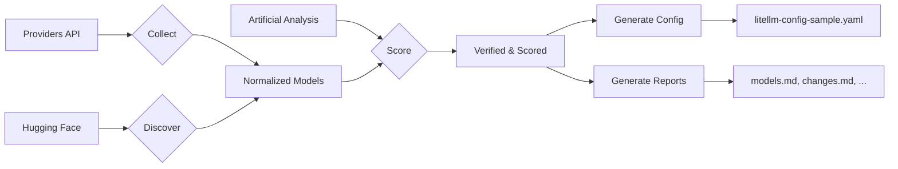

<p align="center">
  <picture>
    <source media="(prefers-color-scheme: dark)" srcset="https://img.shields.io/badge/status-active-2ea043?style=for-the-badge&logo=python&logoColor=white">
    
  </picture>
  
  
  
  
</p>

<h1 align="center">🆓 Free AI Model Router</h1>
<p align="center"><b>Daily ETL that discovers, benchmarks, and ranks <em>free</em> AI coding models —<br>generates a verified LiteLLM routing config with automatic fallback.</b></p>

<p align="center">
  <a href="#features">Features</a> •
  <a href="#how-it-works">How It Works</a> •
  <a href="#quick-start">Quick Start</a> •
  <a href="#cli-reference">CLI Reference</a> •
  <a href="#architecture">Architecture</a> •
  <a href="#output">Output</a> •
  <a href="#deployment">Deployment</a>
</p>

---

## Problem

There are dozens of LLM providers offering **free tiers** for coding models — Groq, Gemini, Mistral, OpenRouter, z.ai, Cloudflare, DeepInfra, and many more. But:

- ❓ **Which models are actually free today?** Providers change pricing constantly.
- ❓ **Which are actually good at coding?** A model may be free but useless for real code tasks.
- ❓ **How to build a reliable fallback chain?** Free models come and go. A router needs resilience.
- ❓ **How to verify without manual work?** Checking 20+ providers by hand is impossible to sustain.

## Solution

**Free AI Model Router** is an automated ETL pipeline that answers these questions daily:

1. **Collects** model lists from every free-tier provider
2. **Discovers** new candidates from Hugging Face and aggregator benchmarks
3. **Scores** each model against the **Artificial Analysis Coding Agent Index** — the most comprehensive public benchmark for AI coding ability
4. **Verifies** that models are actually accessible via API (runtime checks with real keys)
5. **Generates** a ready-to-use **LiteLLM proxy config** with provider-diverse fallback chains
6. **Reports** everything — models ranked, changes since last run, source health, discovered candidates

All models scoring **≥70%** of the reference (ChatGPT-5.6 Sol High = 100%) are eligible for routing.

---

## Features

| | Capability | Detail |
|---|---|---|
| 🔍 | **Provider Discovery** | 22 providers (OpenRouter, Groq, Gemini, Mistral, z.ai, OpenCode Zen, Cloudflare, DeepInfra, Together, Fireworks, GitHub Models, and more) |
| 📊 | **Benchmark Integration** | Artificial Analysis Coding Agent Index (primary), with terminal_bench, SWE-bench, intelligence index components |
| ⚙️ | **Two Scoring Modes** | `composite_primary` — AA index drives the score, component adjustments; `component_weighted` — full recalculation from individual benchmarks |
| 🔐 | **Runtime Verification** | Actual API calls to confirm model accessibility, measure latency, and detect failures |
| ♻️ | **Provider Diversity** | Fallback chain prioritizes different providers — no single point of failure |
| 📅 | **Daily Automation** | GitHub Actions workflow runs every day at 05:17 UTC, commits only on meaningful changes |
| 🐳 | **Docker-Ready** | Slim Python image, ready for deployment on any server |
| 📋 | **Four Reports** | `models.md` (ranked list), `changes.md` (diff from last run), `sources-health.md` (data freshness), `discovered-candidates.md` (new finds) |

---

## How It Works



### Data Pipeline (7 stages)

```
Raw (provider JSON)  ──collect──▶  Normalized (CanonicalModel + ProviderEndpoint)
                                    │
                                    ▼
Discovered Candidates  ◀──discover── TF-IDF / similarity matching
                                    │
                                    ▼
Benchmark Scores  ◀──benchmark──  Artificial Analysis API
                                    │
                                    ▼
Verified Endpoints  ◀──verify────  Runtime API calls
                                    │
                                    ▼
Scored Rankings  ◀──score───────  ScoringEngine (2 modes)
                                    │
                                    ▼
Router Output  ◀──route─────────  Fallback chain builder
                                    │
                                    ▼
litellm-config-sample.yaml  +  reports/
```

---

## Quick Start

### Installation

```bash
pip install -e ".[dev]"
```

### Run the Full Pipeline (Requires API Keys)

```bash
# Set at least one provider key
export OPENROUTER_API_KEY="sk-or-..."
export GEMINI_API_KEY="AIza..."

# Full pipeline
python -m free_ai_model_router run-all
```

### Run Individual Steps

```bash
# 1. Collect models from all providers
python -m free_ai_model_router collect

# 2. Discover new candidates from Hugging Face
python -m free_ai_model_router discover

# 3. Collect benchmarks and score models
python -m free_ai_model_router rank

# 4. Verify API access (needs API keys)
python -m free_ai_model_router verify

# 5. Generate LiteLLM config
python -m free_ai_model_router generate

# 6. Generate reports
python -m free_ai_model_router report
```

### Offline / Cache-Only Mode

```bash
# Skip all network requests, use only cached data
python -m free_ai_model_router run-all --offline
```

---

## CLI Reference

| Command | Description |
|---|---|
| `collect` | Fetch model lists from all configured provider APIs |
| `discover` | Find new model candidates on Hugging Face Hub |
| `verify` | Run runtime API checks against verified endpoints |
| `rank` | Fetch benchmarks and compute final scores |
| `generate` | Produce `output/litellm-config-sample.yaml` |
| `report` | Generate all reports in `reports/` |
| `run-all` | Execute the entire pipeline end-to-end |

**Global options:**

| Flag | Description |
|---|---|
| `--log-level` | Logging level: `DEBUG`, `INFO` (default), `WARNING` |
| `--base-dir` | Repository base directory (auto-detected by default) |
| `--offline` | Skip all network requests |
| `--no-runtime-checks` | Skip API verification probes |
| `--use-cache` | Use cached data when fresh (default: enabled) |

---

## Architecture

```
free-ai-model-router/
│
├── config/                          # 📋 YAML configuration
│   ├── providers.yaml               #   22 providers with API styles and endpoints
│   ├── sources.yaml                 #   9 benchmark/aggregator sources
│   ├── scoring.yaml                 #   Thresholds, weights, penalties
│   ├── model-aliases.yaml           #   Manual identity mappings
│   └── manual-overrides.yaml        #   Expert overrides with expiry
│
├── src/free_ai_model_router/
│   ├── models.py                    # 🏗️ Pydantic v2 strict models (22 classes)
│   ├── cli.py                       # 🎛️ Click-based CLI (7 commands)
│   ├── config_loader.py             # 📖 YAML → typed Pydantic configs
│   │
│   ├── http_client/                 # 🌐 Shared HTTP infrastructure
│   │   └── client.py                #   ETag caching, retry, SSRF whitelist
│   │
│   ├── storage/                     # 💾 Persistence layer
│   │   ├── cache.py                 #   TTL-based JSON cache
│   │   └── state.py                 #   Pipeline state + normalised data I/O
│   │
│   ├── pipeline/                    # 🔄 Orchestration
│   │   └── orchestrator.py          #   Full pipeline coordinator
│   │
│   ├── collectors/                  # 📡 External data sources
│   │   ├── artificial_analysis.py   #   Coding Agent Index (API + page fallback)
│   │   └── huggingface.py           #   HF Hub model discovery
│   │
│   ├── providers/                   # 🔌 Provider adapters
│   │   ├── base.py                  #   ProviderAdapter protocol
│   │   ├── openrouter.py            #   OpenRouter
│   │   ├── opencode_zen.py          #   OpenCode Zen
│   │   ├── zai.py                   #   z.ai
│   │   ├── groq.py                  #   Groq
│   │   ├── gemini.py                #   Google Gemini
│   │   └── mistral.py               #   Mistral AI
│   │
│   ├── scoring/                     # 📐 Scoring engine
│   │   └── engine.py                #   composite_primary + component_weighted
│   │
│   └── generation/                  # 📦 Output generators
│       ├── litellm_config.py        #   LiteLLM proxy YAML with fallbacks
│       └── reports.py               #   models.md, changes.md, sources-health.md
│
├── tests/                           # 🧪 20 unit tests (pytest)
├── output/                          # 📤 Generated LiteLLM config
├── reports/                         # 📄 Generated reports
├── data/                            # 🗃️ Cache, normalized data, history
│
├── Dockerfile                       # 🐳 Container image
├── .github/workflows/daily-update.yml  # 🤖 Scheduled CI/CD
└── pyproject.toml                   # 📦 Python packaging
```

### Key Design Decisions

- **Pydantic v2 at every boundary**: Incoming provider data, normalized models, score inputs, and output configs are all validated through strict schemas. Invalid data fails early.
- **Artifact-based data flow**: Each pipeline stage produces a typed, timestamped, schema-versioned artifact (raw → normalized → verified → scored → filtered → generated).
- **Shared HTTP infrastructure**: All providers and collectors use `HttpClient` — retry logic, ETag/Last-Modified caching, SSRF domain whitelist, and rate limiting are implemented once.
- **Adapter protocol, not inheritance**: Every provider implements `ProviderAdapter` as a duck-typed protocol. No shared base class, no diamond inheritance.
- **Scoring as interchangeable strategies**: `CompositePrimaryScorer` and `ComponentWeightedScorer` share `ScoreInput`. Adding a third mode doesn't touch existing code.
- **Failures are data, not exceptions**: A provider outage is a typed `VerificationStatus`, not an unhandled `HTTPError`. The pipeline completes even when sources fail.

---

## Output

### `output/litellm-config-sample.yaml`

A ready-to-use LiteLLM proxy configuration:

```yaml
model_list:
  # OpenRouter :: google/gemini-2.5-flash-1m:free
  #   Score: 92.3% | Band: excellent
  #   Free status: verified_free
  #   Rank: 1
  - model_name: coding-primary
    litellm_params:
      model: openrouter/google/gemini-2.5-flash-1m:free
      api_base: https://openrouter.ai/api/v1
      api_key: os.environ/OPENROUTER_API_KEY
      timeout: 180

  # Groq :: llama-3.3-70b-versatile
  #   Score: 87.1% | Band: excellent
  #   Free status: documented_free
  #   Rank: 2
  - model_name: coding-fallback-1
    litellm_params:
      model: groq/llama-3.3-70b-versatile
      api_base: https://api.groq.com/openai/v1
      api_key: os.environ/GROQ_API_KEY
      timeout: 180

router_settings:
  fallbacks:
    - coding-auto:
        - coding-primary
        - coding-fallback-1
        - coding-fallback-2
```

### `reports/models.md`

Full ranked model table with scores, confidence bands, free status, and throttling info.

### `reports/changes.md`

Diff from the previous run: newly added models, removed models, status changes.

### `reports/sources-health.md`

Operational status of every data source — when it last succeeded, consecutive failures, staleness.

### `reports/discovered-candidates.md`

Models found on Hugging Face that aren't yet in the routing table — candidates for manual review.

---

## Configuration

All configuration is in `config/` as plain YAML files:

| File | Purpose |
|---|---|
| `providers.yaml` | 22 provider definitions with API endpoints, auth style, priority |
| `sources.yaml` | 9 data source definitions with cache TTL, staleness thresholds |
| `scoring.yaml` | Quality threshold (70%), weights, penalties, reference model |
| `model-aliases.yaml` | Manual identity mappings (e.g. `openrouter:openai/gpt-4o` ↔ `openai/gpt-4o`) |
| `manual-overrides.yaml` | Expert overrides for edge cases (with expiry dates) |

### Required Environment Variables

| Variable | Required For |
|---|---|
| `OPENROUTER_API_KEY` | OpenRouter model collection + verification |
| `GEMINI_API_KEY` | Gemini model collection + verification |
| `GROQ_API_KEY` | Groq model collection + verification |
| `MISTRAL_API_KEY` | Mistral model collection + verification |
| `ZAI_API_KEY` | z.ai model collection + verification |
| `OPENCODE_ZEN_API_KEY` | OpenCode Zen model collection + verification |
| `ARTIFICIAL_ANALYSIS_API_KEY` | AA benchmark API (free, limited quota) |

---

## Deployment

### Docker

```bash
docker build -t free-ai-model-router .

# Run with API keys
docker run --env-file .env \
  -v $(pwd)/data:/app/data \
  -v $(pwd)/output:/app/output \
  -v $(pwd)/reports:/app/reports \
  free-ai-model-router
```

### Docker Compose (Recommended)

```yaml
services:
  model-router:
    build: .
    env_file: .env
    volumes:
      - ./data:/app/data
      - ./output:/app/output
      - ./reports:/app/reports
    restart: "no"
```

### GitHub Actions (Scheduled)

The included workflow at `.github/workflows/daily-update.yml` runs the pipeline daily at 05:17 UTC. It will:

1. Install dependencies
2. Restore HTTP cache from previous runs
3. Collect, discover, score, verify, generate, and report
4. Commit only if `output/` or `reports/` changed meaningfully

---

## Providers

The pipeline tracks **22 providers**, from broadly free (OpenRouter, Groq, Gemini) to paid-only monitoring (OpenAI, Anthropic, xAI):

| Provider | Free Tier | Adapter | Tracked Since |
|---|---|---|---|
| OpenRouter | ✅ Verified free models | `openrouter` | v0.1 |
| Groq | ✅ Documented free API | `groq` | v0.1 |
| Google Gemini | ✅ AI Studio free tier | `gemini` | v0.1 |
| Mistral AI | ✅ Some free models | `mistral` | v0.1 |
| z.ai | ✅ Account-specific free | `zai` | v0.1 |
| OpenCode Zen | ✅ Verified free | `opencode_zen` | v0.1 |
| GitHub Models | ✅ Free with account | generic | v0.1 |
| Cloudflare Workers AI | ✅ Free tier | generic | v0.1 |
| Hugging Face Inference | ✅ Free inference API | `huggingface` | v0.1 |
| Cerebras Inference | ✅ Free tier | generic | v0.1 |
| SambaNova Cloud | ✅ Free tier | generic | v0.1 |
| Together AI | ✅ Some free models | generic | v0.1 |
| Fireworks AI | ✅ Free tier | generic | v0.1 |
| DeepInfra | ✅ Some free models | generic | v0.1 |
| SiliconFlow | ✅ Free tier | generic | v0.1 |
| Nebius AI Studio | ✅ Free tier | generic | v0.1 |
| Hyperbolic | ✅ Free tier | generic | v0.1 |
| Replicate | ✅ Some free models | generic | v0.1 |
| Cohere | ✅ Free trial | generic | v0.1 |
| DeepSeek | ✅ Some free models | generic | v0.1 |
| OpenAI | ❌ Paid only | generic | v0.1 |
| Anthropic | ❌ Paid only | generic | v0.1 |
| xAI | ❌ Paid only | generic | v0.1 |

Providers without a custom adapter use the **generic OpenAI-compatible** adapter (works for most because they follow the OpenAI API schema).

---

## Testing

```bash
# Run all tests
pytest

# With coverage
pytest --cov=free_ai_model_router

# Specific test file
pytest tests/test_scoring.py -v
```

**20 tests** covering:
- Data model validation (Pydantic schemas, defaults, enums)
- Scoring engine (both modes, penalties, thresholds, confidence levels)
- Provider adapter base (conversion logic, pricing records)
- LiteLLM config generation (YAML output, fallback chain, provider diversity)
- Report generation (models.md, changes.md, sources-health.md)

---

## Project Status

- **2026-07-17**: v0.1 released — initial scaffold, 6 provider adapters, scoring engine, LiteLLM config generation, 20 unit tests
- **Planned**: More provider adapters, LiteLLM integration tests, web UI, historical trend tracking

---

## Contributing

Contributions are welcome! Areas that would be especially valuable:

- Adding adapters for new free providers
- Improving fallback chain heuristics
- Adding more benchmark sources (OpenRouter Arena, LMSYS Chatbot Arena)
- LiteLLM integration tests (actual proxy spin-up)
- Web dashboard for the daily reports

See the [issue tracker](https://github.com/sstpnk/free-ai-model-router/issues) for open tasks.

---

## License

MIT © 2026 [sstpnk](https://github.com/sstpnk)

---

<p align="center">
  <sub>Built with ❤️ for the open-source AI community · No API keys were harmed in the making</sub>
</p>
